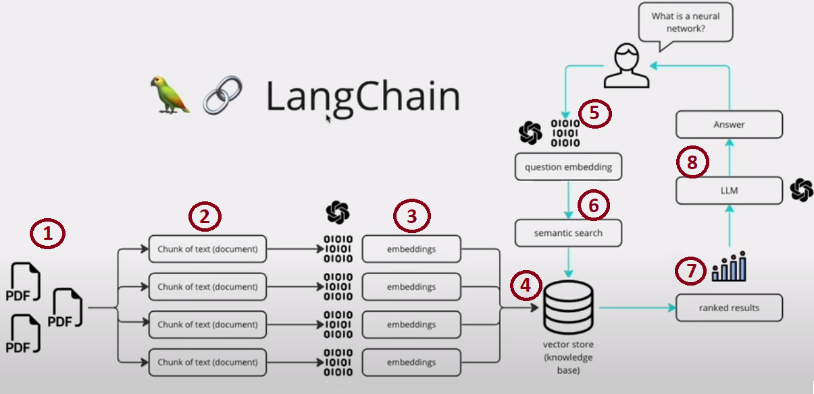

# Introduction


Use ChatGPT API and VectorDB Lookup to personalise your results.

I recommend using [Anaconda](https://www.anaconda.com/download) to maintain python environments.
To have anaconda working seamlessly in VSCode, please read [setup anaconda in vscode](https://opensourceoptions.com/blog/setup-anaconda-python-to-work-with-visual-studio-code-on-windows/)

## Installation
Install [Langchain](https://github.com/hwchase17/langchain)
You may need [C++ Build Tools](https://visualstudio.microsoft.com/visual-cpp-build-tools/) if on Windows

```
pip install langchain openai chromadb tiktoken unstructured
```
Modify `constants.env.py` to use your own [OpenAI API key](https://platform.openai.com/account/api-keys) and rename to `constants.py`.

Place your own data into `data/data.txt`.

## Example
Reading `data/data.txt` file.
```
> python chatgpt.py "what are my favourite fruits?"
Your favorite fruits are apples, bananas, and oranges.
```